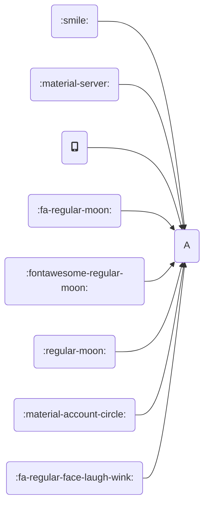
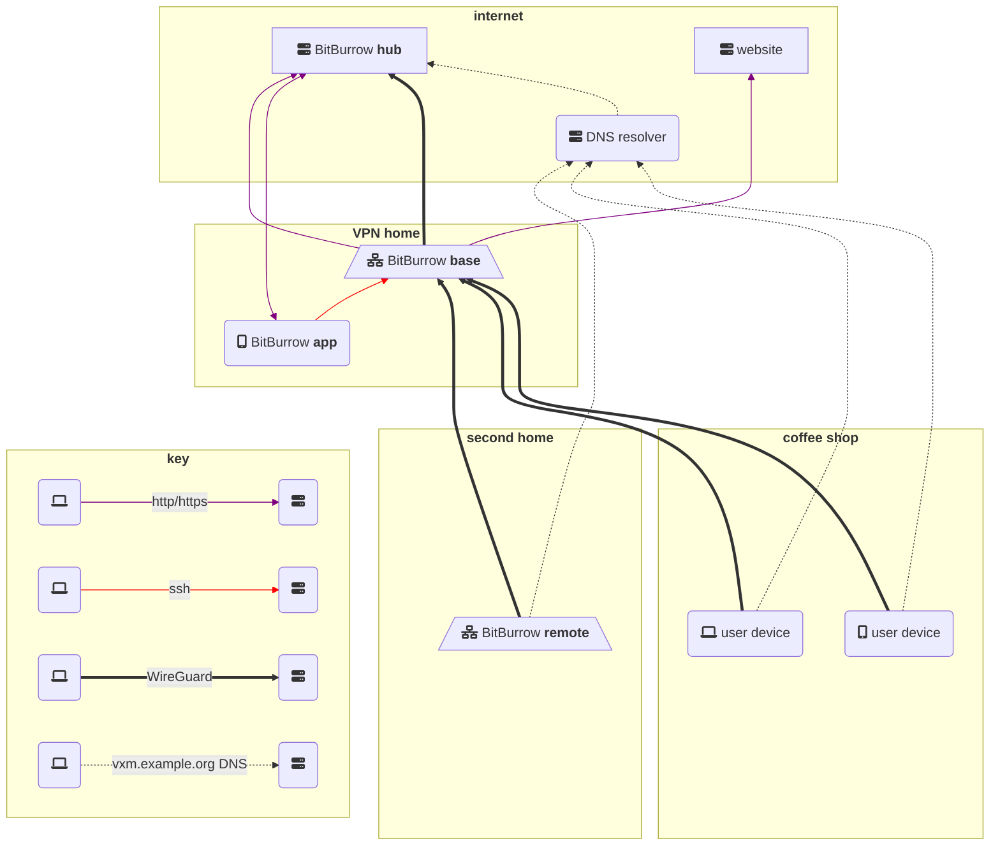

Test icons outside of Mermaid:

1. :smile: `:smile:`
1. :material-server: `:material-server:`
1. fa:fa-mobile-alt `fa:fa-mobile-alt`
1. :fa-regular-moon: `:fa-regular-moon:` (file `docs/assets/.icons/fa/regular/moon.svg`)
1. :fontawesome-regular-moon: `:fontawesome-regular-moon:`
1. :regular-moon: `:regular-moon:`
1. :material-account-circle: `:material-account-circle:`
1. :fa-regular-face-laugh-wink: `:fa-regular-face-laugh-wink:`

Test icons **in** Mermaid:

## NOTE: THIS SOFTWARE DOES NOT EXIST YET

*Everything below is proposed draft documentation. The software to do what is described is being developed and is not at all usable yet.*

## Introduction

BitBurrow is a set of tools to help you set up and use a VPN server anywhere--at your parents' house, an office, or a friend's apartment. And you don't have to be good with computers. A BitBurrow VPN server will allow you to securely use the internet from anywhere in the world as if you were at your "VPN home".

If you just want to set up your own BitBurrow VPN server as described above, skip the rest of this page and go to [How to set up a BitBurrow base](base.md).

## Technical overview

BitBurrow includes four main components:

* BitBurrow **base** is a router at your VPN home that functions as a VPN server. It accepts VPN connections from user devices and forwards them to the internet. See [How to set up a BitBurrow base](base.md).
* BitBurrow **app** runs on Android or iOS and, together with the hub, is used to configure a BitBurrow base.
* BitBurrow **hub** runs on a server on the public internet. It serves to configure a BitBurrow base and also DNS requests from user devices. See [How to set up a BitBurrow hub](hub.md).
* BitBurrow **remote** is a router configured as a VPN client, allowing users at a secondary location to use the internet as if they were at the "VPN home" without any additional software.

Here is a visual representation.

## Links

* [Source code for the BitBurrow hub](https://github.com/BitBurrow/BitBurrow)
* [Source code for the BitBurrow app](https://github.com/BitBurrow/BitBurrow/tree/main/app)
* [Source code for *this* website](https://github.com/BitBurrow/BitBurrow.github.io)
* [BitBurrow website](https://bitburrow.com)

